# Proyecto Integrador DevOps 2203

## Grupo 7 - DevOps2203

- Luis Miguel Mamani Humpiri
- Carlos Ruiz de la Vega
- Reynaldo Capia Capia

## Instrucciones

### Despliegue local

```shell
# first, install and configure CDKv2, kubectl 1.23
cdk deploy

# update kube configuration file with information needed to access the newly created cluster
# this is located on the eks cluster stack output
aws eks update-kubeconfig ...

# test kubectl
kubectl get all

# beware that resources created by kubectl may have to be deleted manually (ie. load balancers)
kubectl apply -f pod.yml
kubectl get pods
kubectl delete -f pod.yml
```

### Configuración EKS Cluster

- La definición del cluster se encuentra en [ClusterStack](cluster/component.py).
- Se usó CDK para la creación de la infraestructura.
- La definición del servicio y el despliegue también se encuentra en ClusterStack.

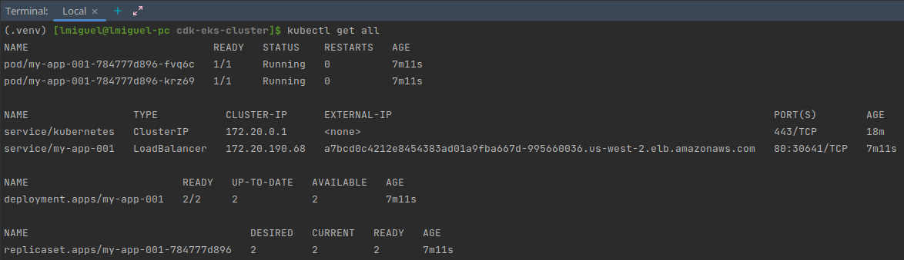
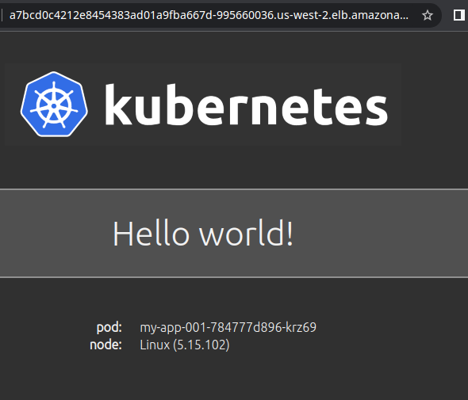

### Configuración de OpenSearch + Fluent Bit

- La definición del cluster se encuentra en [ClusterLoggingStack](cluster_logging/component.py).
- Se usó CDK para la creación de la infraestructura.
- Se usó autenticación por Cognito User Pools en vez de un Master password.
- Así mismo, se creó un serviceAccount para permitir que los pods puedan acceder al API de ES.
    - 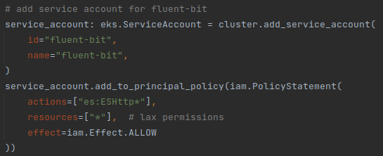
- El mapping de los roles de ES/fluent-bit se encuentra en [ClusterLoggingRolesStack](cluster_logging_roles/component.py).
    - Importante. Incluir el rol creado en el paso anterior.

```shell
# create fluent-bit
# before, edit the file an change the namespace, cluster endpoint and aws region 
kubectl apply -f fluentbit.yaml

# there should be 3 pods for fluent-bit
kubectl get pods

# cleanup
kubectl delete -f fluentbit.yaml
```

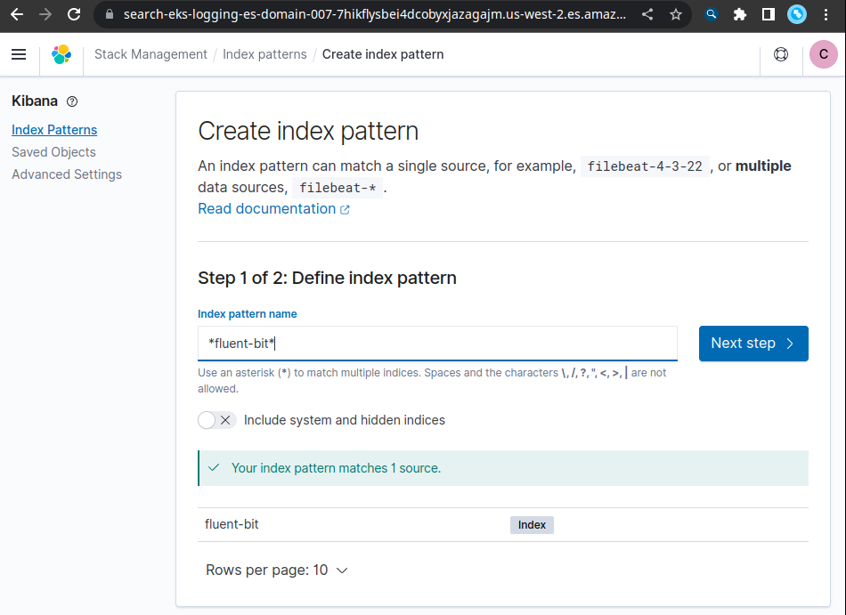

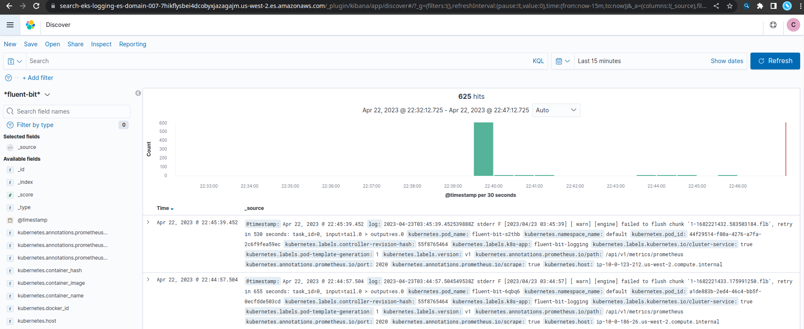

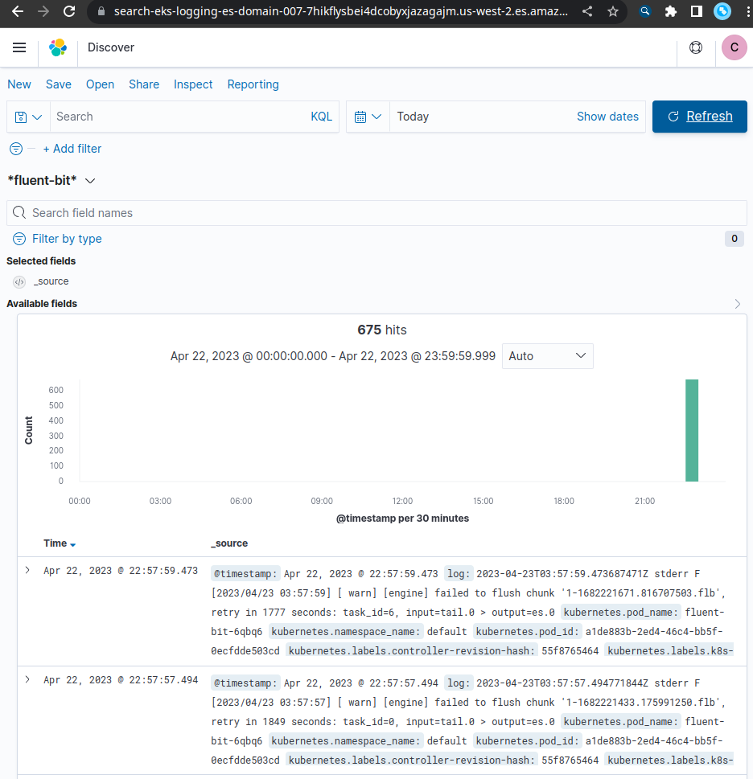

### Configuración de Prometheus + Grafana

```shell
# install helm
# helm 3.9+ breaks some packages, awscliv2 should solve this but in my case didn't
# curl -sSL https://raw.githubusercontent.com/helm/helm/master/scripts/get-helm-3 | bash
# installing helm 3.8.2
curl -L https://git.io/get_helm.sh | bash -s -- --version v3.8.2
helm version --short
helm repo add stable https://charts.helm.sh/stable
helm search repo stable

# add prometheus repo
helm repo add prometheus-community https://prometheus-community.github.io/helm-charts
# add grafana repo
helm repo add grafana https://grafana.github.io/helm-charts
# add support for volumes on EBS 
#helm repo add aws-ebs-csi-driver https://kubernetes-sigs.github.io/aws-ebs-csi-driver
#helm repo update
#helm upgrade --install aws-ebs-csi-driver --namespace kube-system aws-ebs-csi-driver/aws-ebs-csi-driver
# install eksctl - https://github.com/weaveworks/eksctl/releases/

# test EBS CSI driver
# by creating a StorageClass, a PersistentVolumeClaim (PVC) and a pod
# all at once
#kubectl apply -f dynamic-provisioning/
#kubectl get pods
#kubectl delete -f dynamic-provisioning/
# or step by step
kubectl apply -f gp3-sc.yaml
kubectl apply -f pvc-csi.yaml
kubectl apply -f pod-csi.yaml
# pod status should be RUNNING after 60s
kubectl get pod
# pvc status should be BOUND
kubectl get pvc
# check more details of PVC
kubectl describe pvc
# cleanup
kubectl delete -f pod-csi.yaml
kubectl delete -f pvc-csi.yaml
kubectl delete -f gp3-sc.yaml

# install helm
kubectl create namespace prometheus
helm install prometheus prometheus-community/prometheus \
    --namespace prometheus \
    --set alertmanager.persistentVolume.storageClass="gp2" \
    --set server.persistentVolume.storageClass="gp2"

# check pods
kubectl get pods -n prometheus

# cleanup
helm uninstall prometheus --namespace prometheus
kubectl delete ns prometheus
```

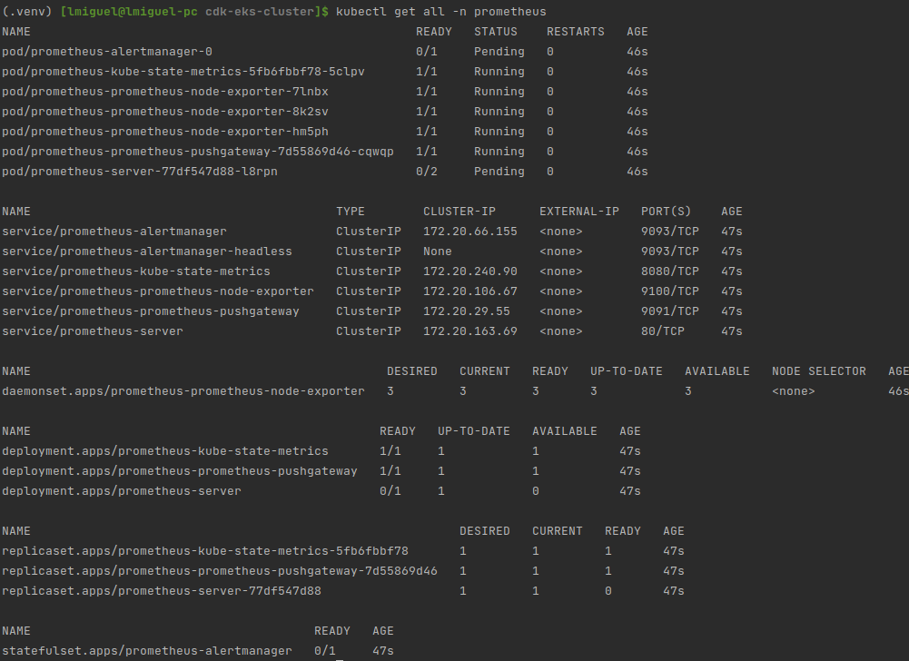

#### Configuración manual

```shell
eksctl create cluster -f config.yaml
kubectl config current-context
kubectl apply -f gp3-sc.yaml
kubectl apply -f pvc-csi.yaml
# check resources 
eksctl get cluster
eksctl get addon --name aws-ebs-csi-driver --cluster ebs-demo-cluster
kubectl get sc

# install
helm install prometheus prometheus-community/prometheus \
    --namespace prometheus \
    --set alertmanager.persistentVolume.storageClass="gp3" \
    --set server.persistentVolume.storageClass="gp3"
# check prometheus
kubectl get all -n prometheus

# cleanup
helm uninstall prometheus --namespace prometheus
kubectl delete -f pvc-csi.yaml
kubectl delete -f gp3-sc.yaml
eksctl delete addon --name aws-ebs-csi-driver --cluster ebs-demo-cluster

```

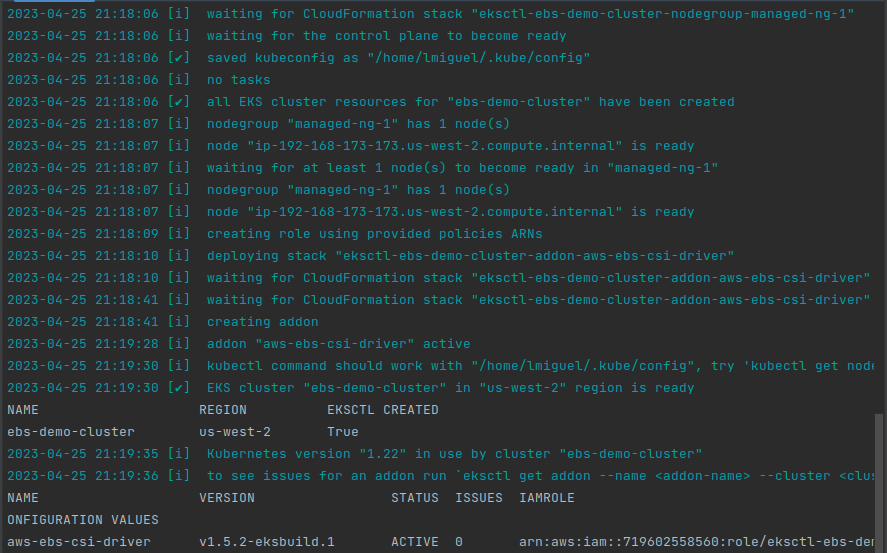
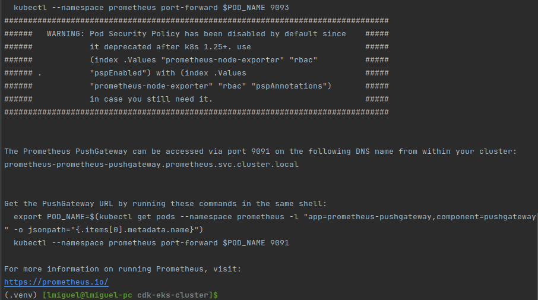


### Despliegue usando un CI/CD pipeline

- Para generar la conexión a Github ir a
    - https://us-east-1.console.aws.amazon.com/codesuite/settings/connections
    - 
    - 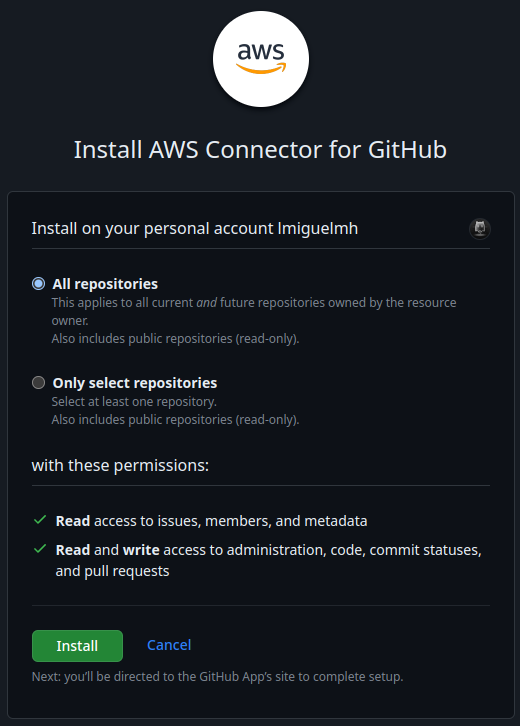
    - 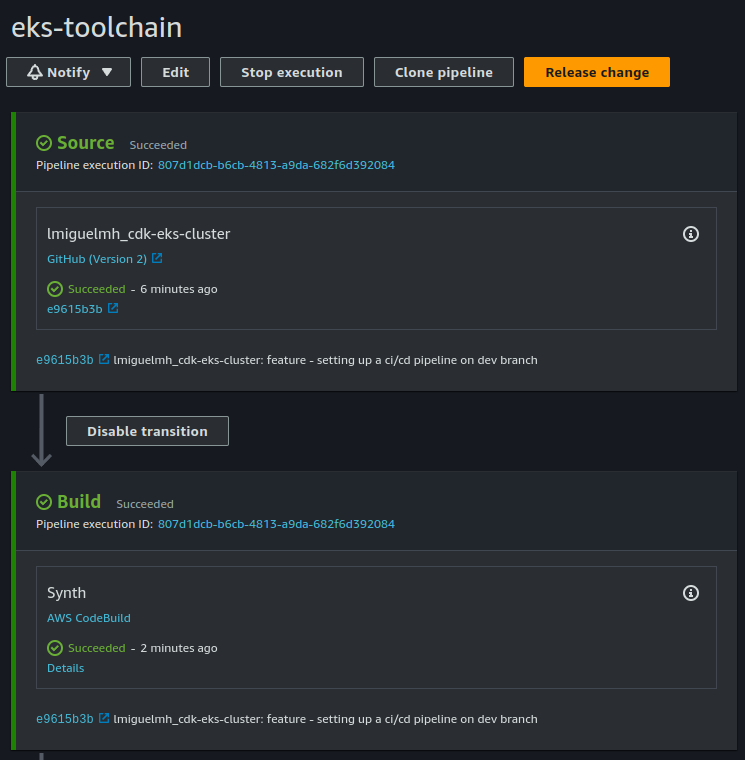

## Problemas

- El despliegue falló porque se llegó al límite de 5 IPs por región.
    - Se solicitó el incremento de número de IPs.
    - 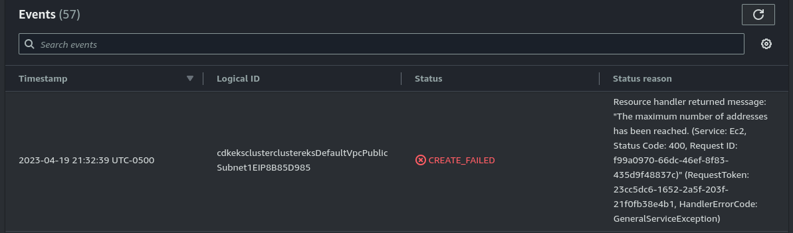

- El despliegue falló por un error en el manifest.
    - Se eliminó el manifest para culminar el despliegue.
    - 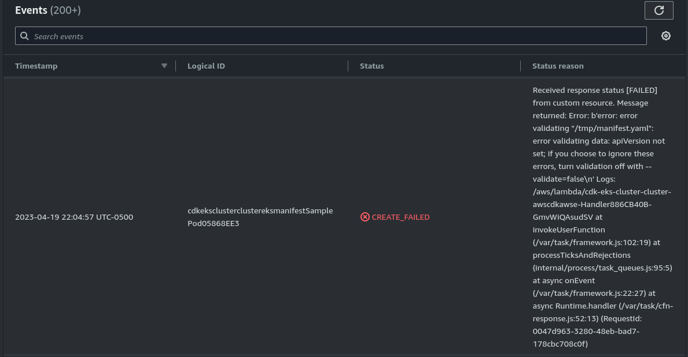

- No se pudo usar kubectl desde local.
    - Se eliminó la versión de kubectl 1.26.3-1.
    - Se recreó la carpeta ~/.kube/
    - Se probó con la versión 1.27, 1.26, 1.25, 1.24, finalmente la
      versión [1.23.17](https://github.com/kubernetes/kubernetes/blob/master/CHANGELOG/CHANGELOG-1.23.md#client-binaries)
    - 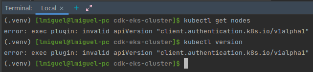

- No se puede acceder a Kibana con el usuario de Cognito.
    - Posiblemente un error de integración entre UserPool y el IdentityPool. Se añadieron roles y redesplegó.
    - 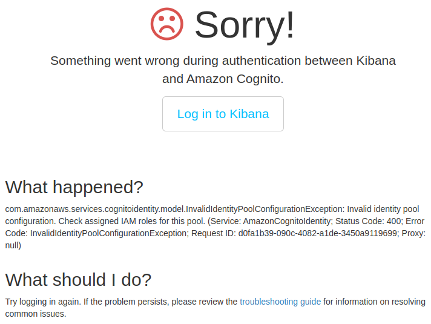

- El despliegue de un manifiesto (service + deployment) falla.
    - Errores de versión de manifiesto. Se corrigió y cambiaron algunos nombres.
    - 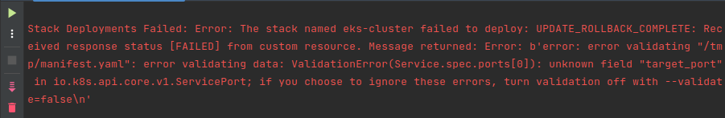

- Problemas al eliminar el Cluster EKS, al parecer algunas VPCs, IGs y subnets no pueden eliminarse.
    - Un balanceador de carga creado con kubectl (manualmente) no podía ser eliminado. Se identificó el balanceador y tuvo que ser eliminado manualmente, luego
      el stack pudo ser eliminado.
    - 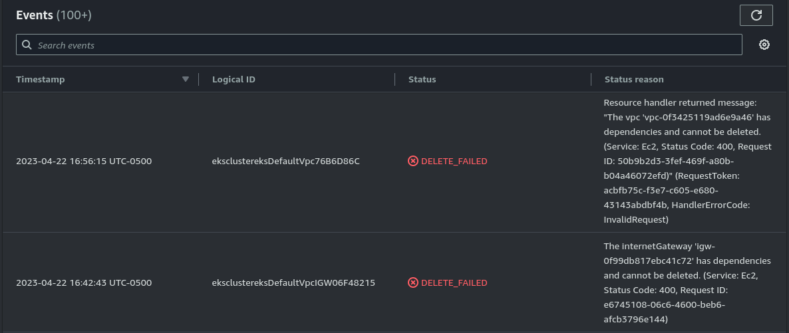
    - 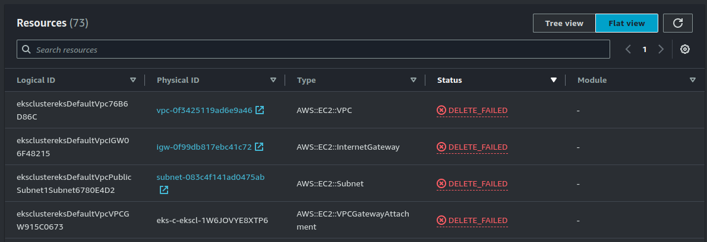
    - 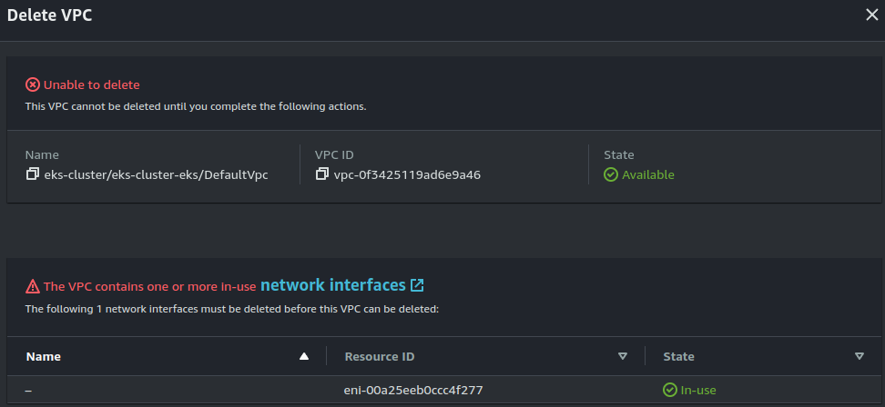
    - 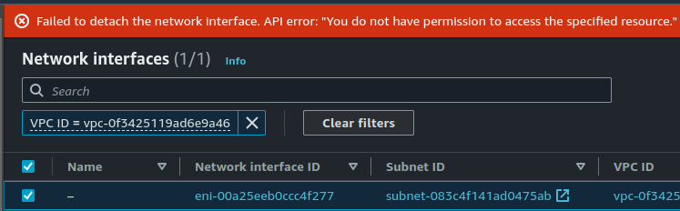

- Error al desplegar Prometheus: INSTALLATION FAILED: Kubernetes cluster unreachable: exec plugin: invalid apiVersion "client.authentication.k8s.io/v1alpha1"
    - Al parecer es un problema de Helm 3.9 + AWS cli v1.
    - Instalando AWS cli v2 no funcionó (https://github.com/helm/helm/issues/10975#issuecomment-1132139799)
    - Tuve que revertir y usar la v3.8.2 de Helm.
    - 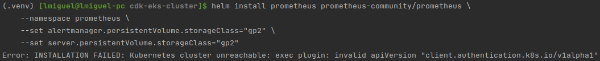

- El pod de helm se queda en _Pending_.
    - 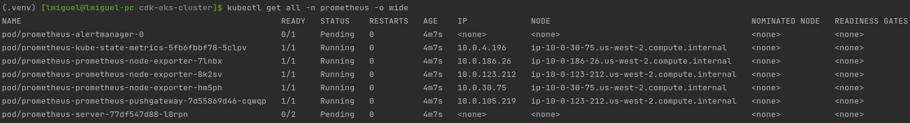
    - No hay logs en `kubectl logs -n prometheus pod/prometheus-server-77df547d88-l8rpn -c prometheus-server`.
    - `kubectl describe -n prometheus pods/prometheus-server-77df547d88-bxtdc` no ayuda:
        - 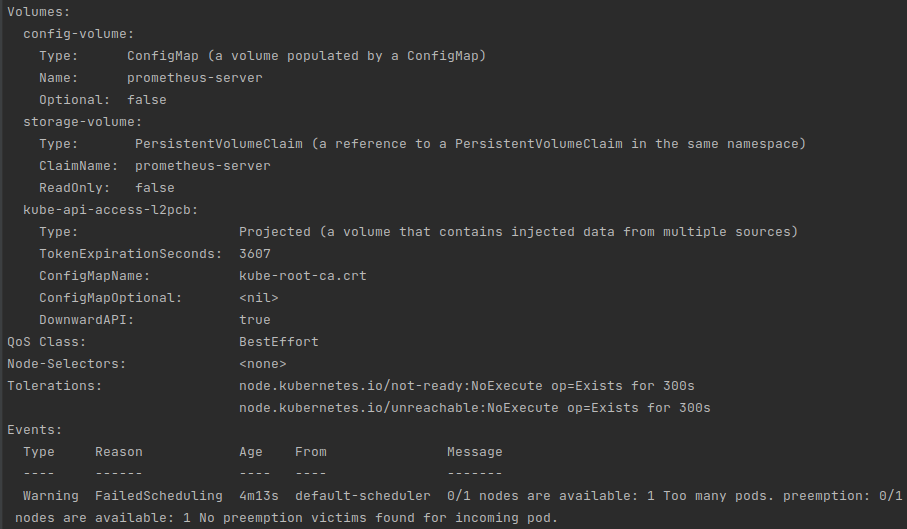
    - `kubectl describe pvc -n prometheus` parece un problema de volúmenes. Al parecer no puede crear algun volumen.
        - 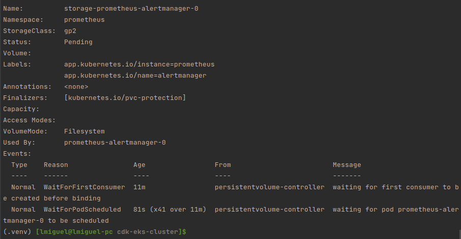
    - Se instaló aws-ebs-csi-driver, ahora todos los pods en _Pending_.
        - 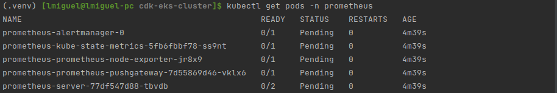
    - Se siguió el siguiente post para [habilitar el almacenamiento persistente en EKS](https://repost.aws/knowledge-center/eks-persistent-storage)
    - Se encontró un problema al crear el ServiceAccount y realizar el despliegue. Solucionado al desinstalar `aws-ebs-csi-driver`, instalado previamente.
        - 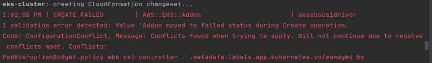
    - Se intentó la configuración del despliegue usando el add-on de EKS para el driver EBS CSI. Pero el pod de prueba de AWS se queda en _Pending_.
        - 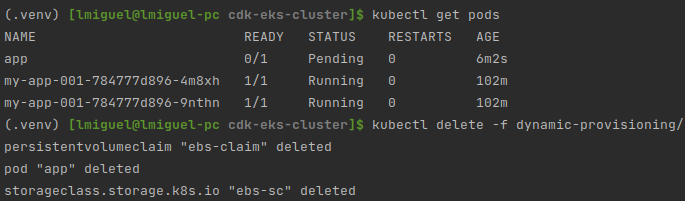
    - Se intentó la [instalación del driver EBS CSI usando helm](https://github.com/kubernetes-sigs/aws-ebs-csi-driver/blob/master/docs/install.md)
        - 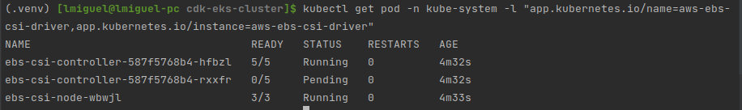
    - Se volvió a reintentar, esta vez siquiendo
      este [blog de AWS para usar el EBS CSI driver como un add-on de EKS](https://aws.amazon.com/blogs/containers/amazon-ebs-csi-driver-is-now-generally-available-in-amazon-eks-add-ons/)
        - Repitiendo los pasos se encontró que el Service Account fue creado en el namespace `default` cuando debió ser creado en el namespace `kube-system`.
        - Así mismo se encontró algunas otras herramientas para diagnosticar los componentes del add-on:
            - `kubectl get deploy,ds -l=app.kubernetes.io/name=aws-ebs-csi-driver -n kube-system`
            - `kubectl get po -n kube-system -l 'app in (ebs-csi-controller,ebs-csi-node)'`
            - `kubectl get -n kube-system pod/ebs-csi-controller-CHANGE_ME -o jsonpath='{.spec.containers[*].name}'`
        - El problema persiste, pero ahora al hacer describe del PersistentVolumeClaim (PVC) obtenemos varios errores.
            - 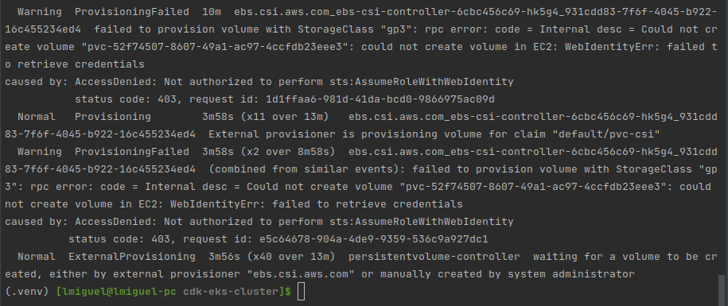
        - Redesplegando el stack, para acelerar las cosas se puede usar otra región para el despliegue, y no esperar a que el cluster se elimine por completo.
        - Problema persiste.
    - Creando el cluster con kubectl según
      el [blog](https://aws.amazon.com/blogs/containers/amazon-ebs-csi-driver-is-now-generally-available-in-amazon-eks-add-ons/), el PVC llega a estado BOUND, y
      el pod a RUNNING! El problema debe estar en la forma en cómo CDK crea el cluster EKS o algún policy o recurso fallido.
        - Se crea el storageClass "gp3".
        - Se reintenta el comando usando "gp3" como storageClass. Algunos recursos funcionan y otros ya no.
            - 
        - No se puede obtener mayor detalle de porqué los pods fallaron.
