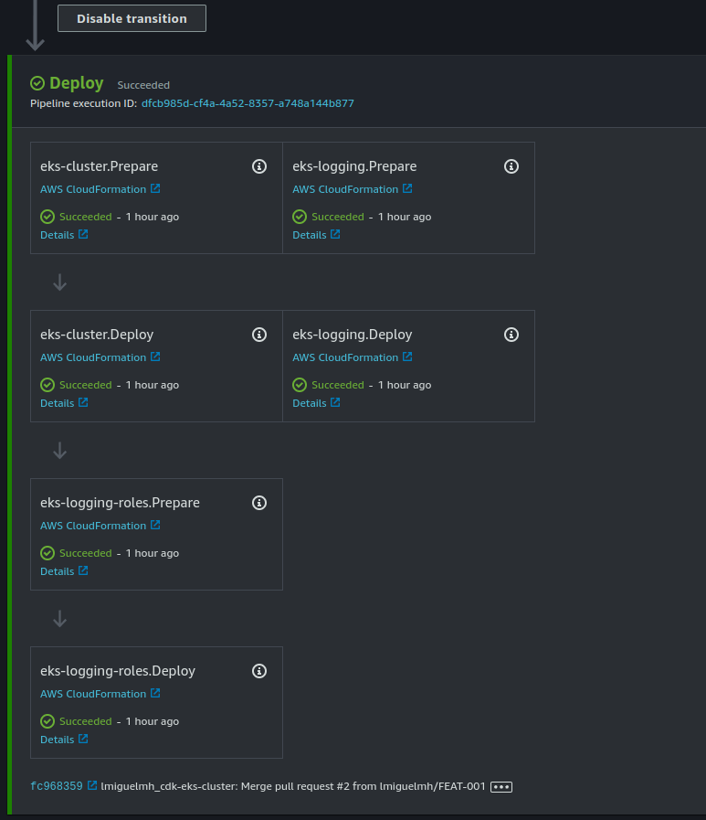

# Proyecto Integrador DevOps 2203 - Grupo 7

En la implementación del presente proyecto se maximizó el uso de infraestructura como código (IaC).
El [repositorio del proyecto se encuentra aquí](https://github.com/lmiguelmh/cdk-eks-cluster).
La infraestructura como código forma parte del pilar de **Excelencia Operacional**
del [AWS Well-Archicted Framework](https://aws.amazon.com/architecture/well-architected).
Como herramienta para la gestión de la IaC se decidió usar el [AWS Cloud Development Kit (CDK)](https://aws.amazon.com/cdk/), principalmente por los beneficios
de:

- Usar abstracciones de alto nivel para definir infraestructura (Constructos de nivel 1, 2 y 3).
- Diseñar y desarrollar componentes de infraestructura reusables.
- Soporte para lenguajes: Typescript/Javascript, Python, Java, GO, .NET.
- Infraestructura y código de aplicación pueden convivir en el mismo repositorio.
- El background de los integrantes del equipo es orientado al área de desarrollo.

## Integrantes

- Luis Miguel Mamani Humpiri
- Carlos Ruiz de la Vega
- Reynaldo Capia Capia

## Crear instancia bastión

El aprovisionamiento del nodo bastión se encuentra en [cdk-bastion](https://github.com/lmiguelmh/cdk-bastion).

El fragmento de código [bastion.py](https://github.com/lmiguelmh/cdk-bastion/blob/dev/core/constructs/bastion.py) define:

1. Tipo y user-data de instancia
2. Storage de instancia
3. Tags de instancia
4. Security group de instancia
5. KeyPair de instancia
6. Rol de instancia
7. Permisos de rol de instancia
8. Tags de rol de instancia
9. Asignación de rol de instancia

```python
# 4. Security group de instancia
self._instance_security_group = ec2.SecurityGroup(
    self,
    "InstanceSecurityGroup",
    security_group_name=f"{construct_id}-security-group",
    vpc=vpc,
    allow_all_outbound=True,
    description="Bastion instance security group",
)
self._instance_security_group.add_ingress_rule(
    ec2.Peer.any_ipv4(),
    ec2.Port.tcp(22),
    "Allows SSH access from any IP"
)

# 5. KeyPair de instancia
self._instance_key_pair = KeyPair(
    self,
    "InstanceKeyPair",
    name=f"{construct_id}-key-pair",
    resource_prefix=f"{construct_id}",
    store_public_key=True,
)

# 6. Rol de instancia
self._instance_role = iam.Role(
    self,
    "InstanceRole",
    role_name=f"{construct_id}-role",
    assumed_by=iam.ServicePrincipal("ec2.amazonaws.com"),
)

# 7. Permisos de rol de instancia
self._instance_role.add_managed_policy(
    iam.ManagedPolicy.from_aws_managed_policy_name("AdministratorAccess")
)
# SSM Agent
self._instance_role.add_managed_policy(
    iam.ManagedPolicy.from_aws_managed_policy_name("AmazonSSMManagedInstanceCore")
)

# 8. Tags de rol de instancia
Tags.of(self._instance_role).add(
    key='RoleName',
    value='ec2-admin-role',
)

# 2. Storage de instancia
self._root_volume: ec2.BlockDevice = ec2.BlockDevice(
    device_name='/dev/xvda',
    volume=ec2.BlockDeviceVolume.ebs(
        volume_size=8,
        volume_type=ec2.EbsDeviceVolumeType.GP2,
    ),
)

# Instancia EC2
self._instance = ec2.Instance(
    self,
    "Instance",
    instance_name=instance_name,
    vpc=vpc,
    vpc_subnets=ec2.SubnetSelection(subnet_type=ec2.SubnetType.PUBLIC),
    # 9. Asignación de rol de instancia
    role=self._instance_role,
    # 4. Security group de instancia
    security_group=self._instance_security_group,
    key_name=self._instance_key_pair.key_pair_name,
    # 1. tipo de instancia
    instance_type=ec2.InstanceType(instance_type),
    # 2. storage de instancia
    block_devices=[self._root_volume],
    machine_image=ec2.MachineImage.from_ssm_parameter(
        # Ubuntu LTS
        parameter_name="/aws/service/canonical/ubuntu/server/focal/stable/current/amd64/hvm/ebs-gp2/ami-id",
        os=ec2.OperatingSystemType.LINUX,
    ),
    # 1. user-data de instancia
    user_data=user_data,
)

# 3. Tags de instancia
Tags.of(self._instance).add(
    key='Name',
    value='Jenkins',
)
```

### Despliegue desde bastión

Desde bastión sólo es necesario desplegar el pipeline. Por defecto, el pipeline será disparado por cambios en la rama definida
en `core.common.PIPELINE_GITHUB_BRANCH`.
Antes de realizar el despliegue se
requiere [acceder a la consola y configurar la conexión a Github aquí](https://us-east-1.console.aws.amazon.com/codesuite/settings/connections).


Al finalizar, completar la información en el archivo de configuración `core.conf.{ENV}`.

```shell
# set the environment/configuration
# on this case we will use the configuration defined on `core.conf.common` and `core.conf.dev`
export ENV=dev

# deploy the pipeline
cdk deploy eks-toolchain
```

### Despliegue desde local

El despliegue desde local permite el desarrollo ágil y el despliegue de uno o varios stacks sin necesidad de desplegar toda la aplicación.

```shell
# set the environment/configuration
export ENV=sandbox

# here we deploy the EKS cluster
cdk deploy eks-cluster

# update kube configuration to access the EKS cluster
# run the command located on the output of ClusterStack
aws eks update-kubeconfig ...

# test kubectl
kubectl get all

# beware that resources created by kubectl need to be deleted manually (ie. load balancers)
kubectl apply -f pod.yml
kubectl get pods
kubectl delete -f pod.yml
```

### Despliegue desde pipeline

El despliegue desde el pipeline se dispara automáticamente cuando se realizan cambios en la rama configurada. En entorno `dev` la rama configurada es `dev`.




### Configuración del Cluster EKS

- La definición del cluster se encuentra en [ClusterStack](cluster/component.py).
- Se usó CDK para la creación de la infraestructura.
    - El aprovisionamiento de los nodos se realiza con un ASG.
    - Otros recursos son aprovisionados
- La definición del servicio y el despliegue de la aplicación de ejemplo también se encuentra en [ClusterStack](cluster/component.py).


### Configuración de OpenSearch + Fluent Bit

- La definición del cluster se encuentra en [ClusterLoggingStack](cluster_logging/component.py).
- Se usó CDK para la creación de la infraestructura.
- Se usó autenticación por Cognito User Pools en vez de un Master password.
- Así mismo, se creó un serviceAccount para permitir que los pods puedan acceder al API de ES.
    - 
- El mapping de los roles de ES/fluent-bit se encuentra en [ClusterLoggingRolesStack](cluster_logging_roles/component.py).
    - Importante. Incluir el rol creado en el paso anterior.

```shell
# create fluent-bit
# before, edit the file an change the namespace, cluster endpoint and aws region 
kubectl apply -f fluentbit.yaml

# there should be 3 pods for fluent-bit
kubectl get pods

# cleanup
kubectl delete -f fluentbit.yaml
```


### Configuración de Prometheus + Grafana

```shell
# install helm
# helm 3.9+ breaks some packages, awscliv2 should solve this but in my case didn't
# curl -sSL https://raw.githubusercontent.com/helm/helm/master/scripts/get-helm-3 | bash
# installing helm 3.8.2
curl -L https://git.io/get_helm.sh | bash -s -- --version v3.8.2
helm version --short
helm repo add stable https://charts.helm.sh/stable
helm search repo stable

# add prometheus repo
helm repo add prometheus-community https://prometheus-community.github.io/helm-charts
# add grafana repo
helm repo add grafana https://grafana.github.io/helm-charts
# add support for volumes on EBS 
#helm repo add aws-ebs-csi-driver https://kubernetes-sigs.github.io/aws-ebs-csi-driver
#helm repo update
#helm upgrade --install aws-ebs-csi-driver --namespace kube-system aws-ebs-csi-driver/aws-ebs-csi-driver
# install eksctl - https://github.com/weaveworks/eksctl/releases/

# https://docs.aws.amazon.com/eks/latest/userguide/csi-iam-role.html
# it will create a policy/role and *annotate* the **existing** ebs-csi-controller-sa service account
# it will NOT create NOR update the ebs-csi-controller-sa (it already exists!)
eksctl create iamserviceaccount \
  --name ebs-csi-controller-sa \
  --namespace kube-system \
  --cluster eks-cluster-eks \
  --attach-policy-arn arn:aws:iam::aws:policy/service-role/AmazonEBSCSIDriverPolicy \
  --approve \
  --role-only \
  --role-name AmazonEKS_EBS_CSI_DriverRole
# https://docs.aws.amazon.com/eks/latest/userguide/managing-ebs-csi.html
# create the addon and attach the role created
eksctl create addon \
  --name aws-ebs-csi-driver \
  --cluster eks-cluster-eks \
  --service-account-role-arn arn:aws:iam::136737878111:role/AmazonEKS_EBS_CSI_DriverRole --force

# test EBS CSI driver
# by creating a StorageClass, a PersistentVolumeClaim (PVC) and a pod
# all at once
#kubectl apply -f dynamic-provisioning/
#kubectl get pods
#kubectl delete -f dynamic-provisioning/
# or step by step
kubectl apply -f gp3-sc.yaml
kubectl apply -f pvc-csi.yaml
kubectl apply -f pod-csi.yaml
# pod status should be RUNNING after ~60s
kubectl get pod --watch
# pvc status should be BOUND
kubectl get pvc
# check more details of PVC
kubectl describe pvc
# cleanup
kubectl delete -f pod-csi.yaml
kubectl delete -f pvc-csi.yaml
kubectl delete -f gp3-sc.yaml

# install helm
kubectl create namespace prometheus
helm install prometheus prometheus-community/prometheus \
    --namespace prometheus \
    --set alertmanager.persistentVolume.storageClass="gp2" \
    --set server.persistentVolume.storageClass="gp2"

# check pods
kubectl get pods -n prometheus --watch

# does not work
# export POD_NAME=$(kubectl get pods --namespace prometheus -l "app=prometheus-pushgateway,component=pushgateway" -o jsonpath="{.items[0].metadata.name}")
# kubectl --namespace prometheus port-forward $POD_NAME 9091

# working
kubectl expose deployment prometheus-server --type=LoadBalancer --name prometheus-server-public --namespace prometheus

# cleanup
helm uninstall prometheus --namespace prometheus
kubectl delete ns prometheus
```


```shell
kubectl create namespace grafana

# doesnt work
helm install grafana grafana/grafana \
    --namespace grafana \
    --set persistence.storageClassName="gp2" \
    --set persistence.enabled=true \
    --set adminPassword='EKS!sAWSome' \
    --values grafana.yml \
    --set service.type=LoadBalancer
```


Luego de eliminar, cambiar el tamaño de los worker nodos, el despliegue funcionó correctamente.


Luego de seleccionar el ID **3119** y el datasource **Prometheus**:


Repetimos para el ID **6417** y el datasource **Prometheus**:


#### Configuración manual

```shell
eksctl create cluster -f config.yaml
kubectl config current-context
kubectl apply -f gp3-sc.yaml
kubectl apply -f pvc-csi.yaml
# check resources 
eksctl get cluster
eksctl get addon --name aws-ebs-csi-driver --cluster ebs-demo-cluster
kubectl get sc

# install
helm install prometheus prometheus-community/prometheus \
    --namespace prometheus \
    --set alertmanager.persistentVolume.storageClass="gp3" \
    --set server.persistentVolume.storageClass="gp3"
# check prometheus
kubectl get all -n prometheus

# cleanup
helm uninstall prometheus --namespace prometheus
kubectl delete -f pvc-csi.yaml
kubectl delete -f gp3-sc.yaml
eksctl delete addon --name aws-ebs-csi-driver --cluster ebs-demo-cluster

```


## Cleanup

Eliminando pasos manuales

```shell
kubectl delete -f fluentbit.yaml
helm uninstall prometheus -n prometheus
kubectl delete ns prometheus
helm uninstall grafana -n grafana
kubectl delete ns grafana

eksctl delete addon \
  --name aws-ebs-csi-driver \
  --cluster eks-cluster-eks
eksctl delete iamserviceaccount \
  --name ebs-csi-controller-sa \
  --namespace kube-system \
  --cluster eks-cluster-eks \
  --wait
```


Eliminando stacks de ES/OS y EKS.


Eliminando pipeline.


## Reporte de costos generados por el proyecto

Algunos de los costos se reducieron debido a la Free Tier de AWS: 100 minutos gratuitos en CodeBuild, 720 horas de instancia EC2 t2.min, etc.


## Problemas

- El despliegue falló porque se llegó al límite de 5 IPs por región.
    - Se solicitó el incremento de número de IPs.
    - 

- El despliegue falló por un error en el manifest.
    - Se eliminó el manifest para culminar el despliegue.
    - 

- No se pudo usar kubectl desde local.
    - Se eliminó la versión de kubectl 1.26.3-1.
    - Se recreó la carpeta ~/.kube/
    - Se probó con la versión 1.27, 1.26, 1.25, 1.24, finalmente la
      versión [1.23.17](https://github.com/kubernetes/kubernetes/blob/master/CHANGELOG/CHANGELOG-1.23.md#client-binaries)
    - 

- No se puede acceder a Kibana con el usuario de Cognito.
    - Posiblemente un error de integración entre UserPool y el IdentityPool. Se añadieron roles y redesplegó.
    - 

- El despliegue de un manifiesto (service + deployment) falla.
    - Errores de versión de manifiesto. Se corrigió y cambiaron algunos nombres.
    - 

- Problemas al eliminar el Cluster EKS, al parecer algunas VPCs, IGs y subnets no pueden eliminarse.
    - Un balanceador de carga creado con kubectl (manualmente) no podía ser eliminado. Se identificó el balanceador y tuvo que ser eliminado manualmente, luego
      el stack pudo ser eliminado.
    - 
    - 
    - 
    - 

- Error al desplegar Prometheus: INSTALLATION FAILED: Kubernetes cluster unreachable: exec plugin: invalid apiVersion "client.authentication.k8s.io/v1alpha1"
    - Al parecer es un problema de Helm 3.9 + AWS cli v1.
    - Instalando AWS cli v2 no funcionó (https://github.com/helm/helm/issues/10975#issuecomment-1132139799)
    - Tuve que revertir y usar la v3.8.2 de Helm.
    - 

- El pod de helm se queda en _Pending_.
    - 
    - No hay logs en `kubectl logs -n prometheus pod/prometheus-server-77df547d88-l8rpn -c prometheus-server`.
    - `kubectl describe -n prometheus pods/prometheus-server-77df547d88-bxtdc` no ayuda:
        - 
    - `kubectl describe pvc -n prometheus` parece un problema de volúmenes. Al parecer no puede crear algun volumen.
        - 
    - Se instaló aws-ebs-csi-driver, ahora todos los pods en _Pending_.
        - 
    - Se siguió el siguiente post para [habilitar el almacenamiento persistente en EKS](https://repost.aws/knowledge-center/eks-persistent-storage)
    - Se encontró un problema al crear el ServiceAccount y realizar el despliegue. Solucionado al desinstalar `aws-ebs-csi-driver`, instalado previamente.
        - 
    - Se intentó la configuración del despliegue usando el add-on de EKS para el driver EBS CSI. Pero el pod de prueba de AWS se queda en _Pending_.
        - 
    - Se intentó la [instalación del driver EBS CSI usando helm](https://github.com/kubernetes-sigs/aws-ebs-csi-driver/blob/master/docs/install.md)
        - 
    - Se volvió a reintentar, esta vez siquiendo
      este [blog de AWS para usar el EBS CSI driver como un add-on de EKS](https://aws.amazon.com/blogs/containers/amazon-ebs-csi-driver-is-now-generally-available-in-amazon-eks-add-ons/)
        - Repitiendo los pasos se encontró que el Service Account fue creado en el namespace `default` cuando debió ser creado en el namespace `kube-system`.
        - Así mismo se encontró algunas otras herramientas para diagnosticar los componentes del add-on:
            - `kubectl get deploy,ds -l=app.kubernetes.io/name=aws-ebs-csi-driver -n kube-system`
            - `kubectl get po -n kube-system -l 'app in (ebs-csi-controller,ebs-csi-node)'`
            - `kubectl get -n kube-system pod/ebs-csi-controller-CHANGE_ME -o jsonpath='{.spec.containers[*].name}'`
        - El problema persiste, pero ahora al hacer describe del PersistentVolumeClaim (PVC) obtenemos varios errores.
            - 
        - Redesplegando el stack, para acelerar las cosas se puede usar otra región para el despliegue, y no esperar a que el cluster se elimine por completo.
        - Problema persiste.
    - Creando el cluster con kubectl según
      el [blog](https://aws.amazon.com/blogs/containers/amazon-ebs-csi-driver-is-now-generally-available-in-amazon-eks-add-ons/), el PVC llega a estado BOUND, y
      el pod a RUNNING! El problema debe estar en la forma en cómo CDK crea el cluster EKS o algún policy o recurso fallido.
        - Se crea el storageClass "gp3".
        - Se reintenta el comando usando "gp3" como storageClass. Algunos recursos funcionan y otros ya no.
            - 
        - No se puede obtener mayor detalle de porqué los pods fallaron.
    - Revisitando el problema y leyendo detenidamente estas [instrucciones](https://docs.aws.amazon.com/eks/latest/userguide/csi-iam-role.html):
        - 
        - 
        - Nuestro error fue ignorar que el service account `ebs-csi-controller-sa` ya existía y por lo tanto **NO** debía ser creado por nosotros. Sólo
          necesitábamos _anotar_ el `ebs-csi-controller-sa` con el rol creado.
        - Ejecutando las instrucciones y desplegando la aplicación de prueba, el PVC llega a estado BOUND y el pod a RUNNING.
            - 
            - 

- Problemas al instalar Grafana.
    - Pod se queda en estado Pending. EBS CSI driver está instalado.
    - 
    - kubectl get ev -n grafana
    - 
    - kubectl get pvc -n grafana
    - 
    - Al ver los eventos creí que era el LB que reiniciaba el pod, al no estar healthy
    - Seguí estas instrucciones para desplegarlo "por partes" (sin LB) https://grafana.com/docs/agent/latest/operator/helm-getting-started/
    - El problema persiste:
        - 
    - Al revisar el manifiesto yml vi que requiere 700MiB de memoria. Eliminé los despliegues de prometheus y volví a ejecutar el despliegue:
        - 
    - Eliminé el despliegue por partes y ejecuté el despliegue usando helm y el pod está en Running!
        - 
    - Redesplegué con nodos de mayor tamaño (8GB de memoria).
        - 
