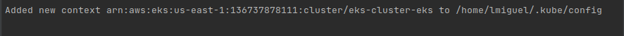
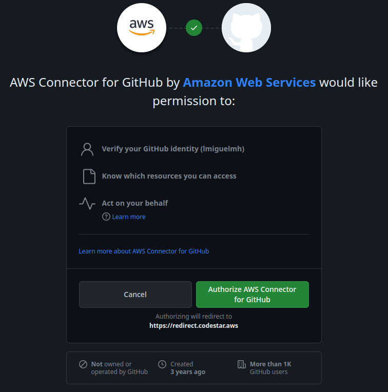
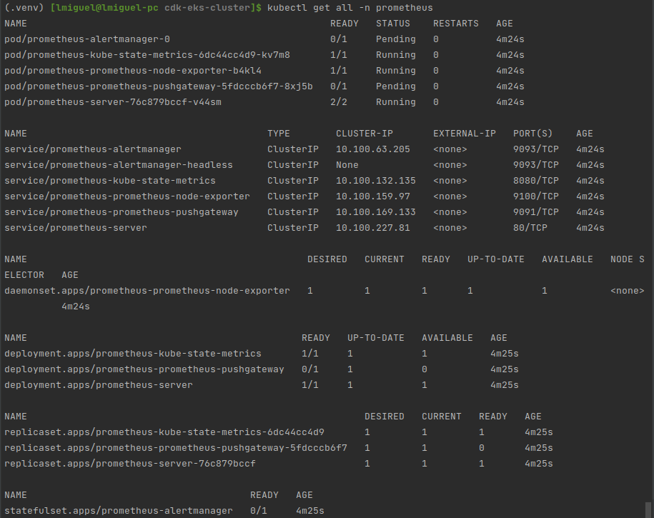

[TOC]

# Proyecto Integrador DevOps 2203 - Grupo 7

En la implementación del presente proyecto se maximizó el uso de infraestructura como código (IaC), el [repositorio del proyecto se encuentra aquí](https://github.com/lmiguelmh/cdk-eks-cluster). La infraestructura como código forma parte del pilar de **Excelencia Operacional** del [AWS Well-Archicted Framework](https://aws.amazon.com/architecture/well-architected).

Al finalizar se pudo automatizar todo, a excepción de (1) despliegue de prometheus (2) despliegue de grafana, debido a los problemas que se explican en su momento. Como herramienta para la gestión de la IaC se decidió usar el [AWS Cloud Development Kit (CDK)](https://aws.amazon.com/cdk/), principalmente por los beneficios de:

- Usar abstracciones de alto nivel para definir infraestructura (Constructos de nivel 1, 2 y 3).
- Diseñar y desarrollar componentes de infraestructura reusables.
- Soporte para lenguajes: Typescript/Javascript, Python, Java, GO, .NET.
- Infraestructura y código de aplicación pueden convivir en el mismo repositorio.
- El background de los integrantes del equipo es orientado al área de desarrollo.

## Integrantes

- Luis Miguel Mamani Humpiri
- Carlos Ruiz de la Vega
- Reynaldo Capia Capia

## Crear y configurar instancia bastión

El aprovisionamiento y configuración del nodo bastión se encuentra en [cdk-bastion](https://github.com/lmiguelmh/cdk-bastion), este proyecto define la IaC requeridas para la creación y configuración de la instancia bastión así como del rol que se usará. La definición y configuración del bastión se encuentra en [bastion.py](https://github.com/lmiguelmh/cdk-bastion/blob/dev/core/constructs/bastion.py) e incluye:

1. Tipo y user-data de instancia
2. Storage de instancia
3. Tags de instancia
4. Security group de instancia
5. KeyPair de instancia
6. Rol de instancia
7. Permisos de rol de instancia
8. Tags de rol de instancia
9. Asignación de rol de instancia

```python
# 4. Security group de instancia
self._instance_security_group = ec2.SecurityGroup(
    self,
    "InstanceSecurityGroup",
    security_group_name=f"{construct_id}-security-group",
    vpc=vpc,
    allow_all_outbound=True,
    description="Bastion instance security group",
)
self._instance_security_group.add_ingress_rule(
    ec2.Peer.any_ipv4(),
    ec2.Port.tcp(22),
    "Allows SSH access from any IP"
)

# 5. KeyPair de instancia
self._instance_key_pair = KeyPair(
    self,
    "InstanceKeyPair",
    name=f"{construct_id}-key-pair",
    resource_prefix=f"{construct_id}",
    store_public_key=True,
)

# 6. Rol de instancia
self._instance_role = iam.Role(
    self,
    "InstanceRole",
    role_name=f"{construct_id}-role",
    assumed_by=iam.ServicePrincipal("ec2.amazonaws.com"),
)

# 7. Permisos de rol de instancia
self._instance_role.add_managed_policy(
    iam.ManagedPolicy.from_aws_managed_policy_name("AdministratorAccess")
)
# SSM Agent
self._instance_role.add_managed_policy(
    iam.ManagedPolicy.from_aws_managed_policy_name("AmazonSSMManagedInstanceCore")
)

# 8. Tags de rol de instancia
Tags.of(self._instance_role).add(
    key='RoleName',
    value='ec2-admin-role',
)

# 2. Storage de instancia
self._root_volume: ec2.BlockDevice = ec2.BlockDevice(
    device_name='/dev/xvda',
    volume=ec2.BlockDeviceVolume.ebs(
        volume_size=8,
        volume_type=ec2.EbsDeviceVolumeType.GP2,
    ),
)

# Instancia EC2
self._instance = ec2.Instance(
    self,
    "Instance",
    instance_name=instance_name,
    vpc=vpc,
    vpc_subnets=ec2.SubnetSelection(subnet_type=ec2.SubnetType.PUBLIC),
    # 9. Asignación de rol de instancia
    role=self._instance_role,
    # 4. Security group de instancia
    security_group=self._instance_security_group,
    key_name=self._instance_key_pair.key_pair_name,
    # 1. tipo de instancia
    instance_type=ec2.InstanceType(instance_type),
    # 2. storage de instancia
    block_devices=[self._root_volume],
    machine_image=ec2.MachineImage.from_ssm_parameter(
        # Ubuntu LTS
        parameter_name="/aws/service/canonical/ubuntu/server/focal/stable/current/amd64/hvm/ebs-gp2/ami-id",
        os=ec2.OperatingSystemType.LINUX,
    ),
    # 1. user-data de instancia
    user_data=user_data,
)

# 3. Tags de instancia
Tags.of(self._instance).add(
    key='Name',
    value='Jenkins',
)
```

El stack de la instancia bastión se despliega con el comando `cdk deploy`:


Conectándose a la instancia bastión a través de **Session Manager**:


Conectándose a la instancia bastión a través de SSH. Las llaves se encuentran en Secrets Manager:


## Crear cluster EKS

La definición del cluster EKS se encuentra en [cluster/component.py](cluster/component.py) e incluye:

1. Cluster EKS.
2. Grupo de autoescalamiento para los worker nodes.
3. Llave SSH para acceder a los workers.

```python
# 1. Cluster EKS.
cluster = eks.Cluster(
    self,
    conf.CLUSTER_EKS_NAME,
    cluster_name=conf.CLUSTER_EKS_NAME,
    version=eks.KubernetesVersion.V1_25,
    kubectl_layer=lambda_layer_kubectl_v25.KubectlV25Layer(self, "kubectl"),
    endpoint_access=eks.EndpointAccess.PUBLIC_AND_PRIVATE,
    default_capacity=0,  # will customize it using an ASG
    alb_controller=eks.AlbControllerOptions(
        version=eks.AlbControllerVersion.V2_4_1,
    ),
    cluster_logging=[
        eks.ClusterLoggingTypes.API,
        eks.ClusterLoggingTypes.AUDIT,
        eks.ClusterLoggingTypes.AUTHENTICATOR,
        eks.ClusterLoggingTypes.CONTROLLER_MANAGER,
        eks.ClusterLoggingTypes.SCHEDULER,
    ],
)

# 3. Llave SSH para acceder a los workers.
key_pair = KeyPair(
    self,
    conf.CLUSTER_SSH_KEY_NAME,
    name=conf.CLUSTER_SSH_KEY_NAME,
    resource_prefix=conf.CLUSTER_SSH_KEY_NAME,
)

# 2. Grupo de autoescalamiento para los worker nodes.
cluster.add_auto_scaling_group_capacity(
    conf.CLUSTER_ASG_NAME,
    auto_scaling_group_name=conf.CLUSTER_ASG_NAME,
    instance_type=ec2.InstanceType("t3.large"),
    machine_image_type=eks.MachineImageType.AMAZON_LINUX_2,  # or BOTTLEROCKET
    min_capacity=1,
    desired_capacity=1,
    max_capacity=3,
    vpc_subnets=ec2.SubnetSelection(subnet_type=ec2.SubnetType.PUBLIC),
    key_name=key_pair.key_pair_name,
)
```

El stack del cluster EKS se despliega con el comando `cdk deploy`:


Notar que en la consola EKS la pantalla informativa nos indica que nuestro usuario IAM no tiene acceso a los objetos Kubernetes.


## Mapear usuarios IAM - cluster EKS

Antes de realizar el mapping se debe configurar `kubectl`. Para realizar esto se puede usar el comando que se obtiene de uno de los outputs del stack `eks-cluster`.


Luego de ejecutar el comando `aws eks update-kubeconfig...`:



Ahora, podemos continuar con el mapping. Considerar que anteriormente la consola nos advertía que nuestro usuario IAM no tenía acceso a los objetos de Kubernetes.

`kubectl describe configmap -n kube-system aws-auth`


`kubectl edit -n kube-system configmap/aws-auth`


`kubectl describe configmap -n kube-system aws-auth`


Ahora, en la consola EKS, la advertencia desaparece y podemos ver los recursos del cluster.


## Crear AWS Code Pipeline

La definición del pipeline para CI/CD se encuentra en [pipeline.py](pipeline.py) e incluye:

1. Rol del pipeline.
2. Paso de sintetización a Cloudformation.
3. Datos del repositorio.
4. Pasos de ejecución.
5. Paso de despliegue.

```python
pipeline = codepipeline.Pipeline(
    scope=self,
    id="Pipeline",
    pipeline_name=conf.PIPELINE_STACK_NAME,
    restart_execution_on_update=True,
    artifact_bucket=s3.Bucket(
        self,
        conf.PIPELINE_ARTIFACT_BUCKET_NAME,
        bucket_name=conf.PIPELINE_ARTIFACT_BUCKET_NAME,
        auto_delete_objects=True,
        removal_policy=cdk.RemovalPolicy.DESTROY,
    ),
)

# 1. Rol del pipeline.
pipeline_role = iam.Role(
    pipeline,
    conf.PIPELINE_ROLE_NAME,
    role_name=conf.PIPELINE_ROLE_NAME,
    assumed_by=iam.ServicePrincipal("codebuild.amazonaws.com"),
)
pipeline_role.attach_inline_policy(
    iam.Policy(
        id="FullAccessPolicy",
        scope=pipeline,
        # TODO reduce permissions
        statements=[iam.PolicyStatement(
            resources=["*"],
            actions=["*"],
            effect=iam.Effect.ALLOW,
        )]
    )
)

# 2. Paso de sintetización a Cloudformation.
synth = pipelines.CodeBuildStep(
    id="Synth",
    role=pipeline_role,
    # 3. Datos del repositorio.
    input=pipelines.CodePipelineSource.connection(
        repo_string=conf.PIPELINE_GITHUB_REPOSITORY,
        branch=conf.PIPELINE_GITHUB_BRANCH,
        connection_arn=conf.PIPELINE_GITHUB_CONNECTION_ARN,
    ),
    env={
        nameof(conf.ENV): conf.ENV,
    },
    install_commands=[
        "python -m pip install -r requirements.txt",
    ],
    commands=[
        f"npx cdk synth {conf.PIPELINE_STACK_NAME}",
    ],
)
code_pipeline = pipelines.CodePipeline(
    scope=self,
    id="CodePipeline",
    code_pipeline=pipeline,
    docker_enabled_for_synth=True,
    publish_assets_in_parallel=True,
    synth=synth,
)

# 5. Paso de despliegue.
stage = Stage(
    scope=code_pipeline,
    id="Deploy",
    env=target_aws_env,
)
workload = Workload(
    scope=stage,
    construct_id=conf.PIPELINE_WORKLOAD_NAME,
    aws_env=target_aws_env,
)
stage_deployment = code_pipeline.add_stage(stage)

# 4. Pasos de ejecución.
deploy_step = pipelines.CodeBuildStep(
    "PostDeploy",
    env_from_cfn_outputs={
        "EKS_UPDATE_KUBECONFIG": workload.cluster.eks_update_kubeconfig_cfn_output,
        "ES_ENDPOINT": workload.cluster_logging.es_domain_endpoint_cfn_output,
        # AWS_REGION is already defined on the environment
    },
    role=pipeline_role,
    commands=[
        "mkdir -p ~/.kube",
        "eval $EKS_UPDATE_KUBECONFIG",

        # install fluent-bit
        "cat fluentbit.yaml | envsubst > fluentbit.yaml",
        "kubectl apply -f fluentbit.yaml ",  # 2nd run it fails with error: no objects passed to apply
        "kubectl --namespace=logging get sa",
        "kubectl --namespace=logging get pods",

        # enable oidc provider
        "eksctl utils --cluster eks-cluster-eks associate-iam-oidc-provider --approve",
    ],
)
stage_deployment.add_post(deploy_step)
```

Antes de realizar el despliegue del stack del pipeline se requiere [configurar la conexión a Github](https://us-east-1.console.aws.amazon.com/codesuite/settings/connections).




El stack del pipeline se despliega con el comando `cdk deploy eks-toolchain`.


### Despliegue desde pipeline

El despliegue desde el pipeline se dispara automáticamente cuando se realizan cambios en la rama configurada. En entorno `dev` la rama configurada es `dev`.


La aplicación demo funcionando:


### Despliegue desde local

El despliegue desde local permite el desarrollo ágil y el despliegue de uno o varios stacks sin necesidad de desplegar toda la aplicación.

```shell
# set the environment/configuration
export ENV=sandbox
# here we *only* deploy the EKS cluster
cdk deploy eks-cluster
# update kube configuration to access the EKS cluster
aws eks update-kubeconfig ...
# test kubectl
kubectl get all
```

## Instalar herramientas de monitoreo

La definición del cluster de ElasticSearch-Kibana (OpenSearch) se encuentran en [cluster_logging/component.py](cluster_logging/component.py). Adicionalmente, se usa autenticación mediante usuarios de Cognito (en vez de un master password).

```python
es_role = iam.Role(
    scope=self,
    id=f"ESRole",
    assumed_by=iam.ServicePrincipal("es.amazonaws.com"),
    managed_policies=[iam.ManagedPolicy.from_aws_managed_policy_name("AmazonESCognitoAccess")]
)

es_domain = elasticsearch.CfnDomain(
    scope=self,
    id=f"SearchDomain",
    elasticsearch_cluster_config=elasticsearch.CfnDomain.ElasticsearchClusterConfigProperty(
        instance_type="t3.small.elasticsearch",
    ),
    ebs_options=elasticsearch.CfnDomain.EBSOptionsProperty(
        volume_size=10,
        ebs_enabled=True,
    ),
    elasticsearch_version="7.9",
    domain_name=conf.LOGGING_ES_DOMAIN_NAME,
    node_to_node_encryption_options=elasticsearch.CfnDomain.NodeToNodeEncryptionOptionsProperty(
        enabled=True,
    ),
    encryption_at_rest_options=elasticsearch.CfnDomain.EncryptionAtRestOptionsProperty(
        enabled=True,
    ),
    advanced_security_options=elasticsearch.CfnDomain.AdvancedSecurityOptionsInputProperty(
        enabled=True,
        master_user_options=elasticsearch.CfnDomain.MasterUserOptionsProperty(
            master_user_arn=es_admin_fn_role.role_arn
        ),
    ),
    domain_endpoint_options=elasticsearch.CfnDomain.DomainEndpointOptionsProperty(
        enforce_https=True
    ),
    cognito_options=elasticsearch.CfnDomain.CognitoOptionsProperty(
        enabled=True,
        identity_pool_id=identity_pool.ref,
        role_arn=es_role.role_arn,
        user_pool_id=user_pool.ref
    ),
    # don't use this without fine-grained access control, vpc support, or ip based restrictions as this allows anonymous access
    access_policies={
        "Version": "2012-10-17",
        "Statement": [
            {
                "Effect": "Allow",
                "Principal": {
                    "AWS": "*"
                },
                "Action": "es:ESHttp*",
                "Resource": domain_arn
            }
        ]
    }
)
```

La definición del namespace `logging` y del service account para Fluent-Bit se encuentran en [cluster/component.py](cluster/component.py):

```python
namespace = cluster.add_manifest(
    "logging-namespace",
    {
        "apiVersion": "v1",
        "kind": "Namespace",
        "metadata": {
            "name": "logging",
        },
    }
)
service_account: eks.ServiceAccount = cluster.add_service_account(
    id="fluent-bit",
    name="fluent-bit",
    namespace="logging",  # fluent-bit.yml uses this namespace
)
service_account.add_to_principal_policy(iam.PolicyStatement(
    actions=["es:ESHttp*"],
    resources=["*"],  # TODO point to the ES cluster arn
    effect=iam.Effect.ALLOW
))
```

La configuración para el acceso a ElasticSearch desde el service account de Fluent-Bit y desde otros recursos se encuentran en [cluster_logging_roles/component.py](cluster_logging_roles/component.py). Esto se realiza a través de una llamada a una lambda que tiene permisos para llamar al API de administración de ElasticSearch. De esta forma los pods desplegados pueden tener acceso a ElasticSearch.

```python
es_requests = ESRequests(
    scope=self,
    name=conf.LOGGING_ES_DOMAIN_ES_REQUESTS_NAME,
    function_role=es_admin_fn_role,
    es_domain_endpoint=es_domain_endpoint,
)
es_requests.add_function()
es_requests.add_custom_resource(
    all_access_roles=[
        es_admin_fn_role.role_arn,
        es_admin_user_role.role_arn,
        cluster_fluent_bit_service_account_role_arn,
    ],
    security_manager_roles=[
        es_admin_fn_role.role_arn,
        es_admin_user_role.role_arn,
    ],
    kibana_user_roles=[
        es_limited_user_role.role_arn,
    ],
)
```

Finalmente el despliegue de Fluent-Bit se realiza en [pipeline.py](pipeline.py):

```python
deploy_step = pipelines.CodeBuildStep(
    "PostDeploy",
    env_from_cfn_outputs={
        "EKS_UPDATE_KUBECONFIG": workload.cluster.eks_update_kubeconfig_cfn_output,
        "ES_ENDPOINT": workload.cluster_logging.es_domain_endpoint_cfn_output,
        # AWS_REGION is already defined on the environment
    },
    role=pipeline_role,
    commands=[
        "mkdir -p ~/.kube",
        "eval $EKS_UPDATE_KUBECONFIG",

        # deploy fluent-bit
        "cat fluentbit.yaml | envsubst > fluentbit.yaml",
        "kubectl apply -f fluentbit.yaml ",
        "kubectl --namespace=logging get sa",
        "kubectl --namespace=logging get pods",
    ],
)
```

Luego de realizar el PR respectivo a la rama `dev` se despliega el cluster de ElasticSearch, así como Fluent-Bit.


## Desplegar Prometheus

El despliegue de Prometheus no pudo ser automatizado, debido a diversos [problemas](##Problemas) (ver al final). Si bien es cierto se presentaron varios otros incidentes en otras partes, pero ninguno nos costó tanto esfuerzo/tiempo como para el despliegue de Prometheus.

El reto en este paso fue habilitar la persistencia a través del driver EBS CSI. En nuestro caso, esto se complicó aún más por nuestro deseo de _automatizar todo_ el despliegue con CDK. A continuación se presentan los *pasos manuales* que seguimos para el despliegue de Prometheus:

```shell
# install helm 3.8.2 because of aws cli v1
curl -L https://git.io/get_helm.sh | bash -s -- --version v3.8.2
helm version --short
helm repo add stable https://charts.helm.sh/stable
helm search repo stable

# add prometheus repo
helm repo add prometheus-community https://prometheus-community.github.io/helm-charts

# add support for volumes on EBS 
# https://docs.aws.amazon.com/eks/latest/userguide/csi-iam-role.html
# it will create a policy/role and *annotate* the **existing** ebs-csi-controller-sa service account
# it will NOT create NOR update the ebs-csi-controller-sa (it already exists!)
eksctl create iamserviceaccount \
  --name ebs-csi-controller-sa \
  --namespace kube-system \
  --cluster eks-cluster-eks \
  --attach-policy-arn arn:aws:iam::aws:policy/service-role/AmazonEBSCSIDriverPolicy \
  --approve \
  --role-only \
  --role-name AmazonEKS_EBS_CSI_DriverRole
# https://docs.aws.amazon.com/eks/latest/userguide/managing-ebs-csi.html
# create the addon and attach to it the role created before
eksctl create addon \
  --name aws-ebs-csi-driver \
  --cluster eks-cluster-eks \
  --service-account-role-arn arn:aws:iam::136737878111:role/AmazonEKS_EBS_CSI_DriverRole --force

# test the EBS CSI driver by creating a StorageClass, a PersistentVolumeClaim (PVC) and a pod
kubectl apply -f gp3-sc.yaml
kubectl apply -f pvc-csi.yaml
kubectl apply -f pod-csi.yaml
# pod status should be RUNNING after ~60s
kubectl get pod --watch
# pvc status should be BOUND
kubectl get pvc
# check more details of PVC
kubectl describe pvc

# install prometheus
kubectl create namespace prometheus
helm install prometheus prometheus-community/prometheus \
    --namespace prometheus \
    --set alertmanager.persistentVolume.storageClass="gp2" \
    --set server.persistentVolume.storageClass="gp2"

# check pods
kubectl get pods -n prometheus --watch

# expose prometheus endpoint
kubectl expose deployment prometheus-server --type=LoadBalancer --name prometheus-server-public --namespace prometheus
```

Resultados exitosos de la prueba del driver EBS CSI con los manifiestos de prueba:


Resultado exitoso del despliegue de Prometheus:


Luego de exponer Prometheus podemos acceder a la aplicación web:


## Desplegar Grafana

El despliegue de Grafana tampoco pudo ser automatizado. Sin embargo, el reto aquí fue encontrar por qué los pods no iniciaban, lo cual se detalla en [problemas](##Problemas) (ver al final). En resumen, se trataba de un problema de que los worker nodes no tenían suficientes recursos para el despliegue. A continuación se presentan los *pasos manuales* que seguimos para el despliegue de Grafana:

```shell
# add grafana repo
helm repo add grafana https://grafana.github.io/helm-charts

# install grafana
kubectl create namespace grafana
helm install grafana grafana/grafana \
    --namespace grafana \
    --set persistence.storageClassName="gp2" \
    --set persistence.enabled=true \
    --set adminPassword='EKS!sAWSome' \
    --values grafana.yml \
    --set service.type=LoadBalancer
```


Resultado exitoso del despliegue de Grafana:


Luego de acceder a Grafana con las credenciales configuradas en el despliegue:


Luego de seleccionar el ID **3119** y el datasource **Prometheus**:


Repetimos para el ID **6417** y el datasource **Prometheus**:


## Cleanup

Ya que no se pudo automatizar todo, se tienen que realizar los siguientes *pasos manuales*:

```shell
kubectl delete -f fluentbit.yaml
helm uninstall prometheus -n prometheus
kubectl delete ns prometheus
helm uninstall grafana -n grafana
kubectl delete ns grafana

eksctl delete addon \
  --name aws-ebs-csi-driver \
  --cluster eks-cluster-eks
eksctl delete iamserviceaccount \
  --name ebs-csi-controller-sa \
  --namespace kube-system \
  --cluster eks-cluster-eks \
  --wait
```


Luego, se eliminan los stacks de ElasticSearch y EKS:


Finalmente, se elimina el pipeline:


## Costos generados por el proyecto

El costo final fue de **$9.21**. Algunos de los costos se reducieron debido a la Free Tier de AWS: 100 minutos gratuitos en CodeBuild, 720 horas de instancia EC2 t2.min, etc.


## Problemas

- El despliegue falló porque se llegó al límite de 5 IPs por región.
    - Se solicitó el incremento de número de IPs.
    - 

- El despliegue falló por un error en el manifest.
    - Se eliminó el manifest para culminar el despliegue.
    - 

- No se pudo usar kubectl desde local.
    - Se eliminó la versión de kubectl 1.26.3-1.
    - Se recreó la carpeta ~/.kube/
    - Se probó con la versión 1.27, 1.26, 1.25, 1.24, finalmente la
      versión [1.23.17](https://github.com/kubernetes/kubernetes/blob/master/CHANGELOG/CHANGELOG-1.23.md#client-binaries)
    - 

- No se puede acceder a Kibana con el usuario de Cognito.
    - Posiblemente un error de integración entre UserPool y el IdentityPool.
    - Se añadieron roles y redesplegó.
    - 

- El despliegue de un manifiesto (service + deployment) falla.
    - Errores de versión de manifiesto.
    - Se corrigió y cambiaron algunos nombres.
    - 

- Problemas al eliminar el Cluster EKS, al parecer algunas VPCs, IGs y subnets no pueden eliminarse.
    - Un balanceador de carga creado con kubectl (manualmente) no podía ser eliminado.
    - Se identificó el balanceador y tuvo que ser eliminado manualmente, luego el stack pudo ser eliminado.
    - 
    - 
    - 
    - 

- Error al desplegar Prometheus: _INSTALLATION FAILED: Kubernetes cluster unreachable: exec plugin: invalid apiVersion "client.authentication.k8s.io/v1alpha1"_
    - Al parecer es un problema de Helm 3.9 + AWS cli v1.
    - [Instalando AWS cli v2](https://github.com/helm/helm/issues/10975#issuecomment-1132139799) no funcionó.
    - Tuve que revertir y usar la v3.8.2 de Helm.
    - 

- Varios pods de Prometheus se quedan en estado _Pending_.
    - 
    - No hay logs en `kubectl logs -n prometheus pod/prometheus-server-77df547d88-l8rpn -c prometheus-server`.
    - `kubectl describe -n prometheus pods/prometheus-server-77df547d88-bxtdc` no ayuda:
        - 
    - `kubectl describe pvc -n prometheus` parece un problema de volúmenes. Al parecer no puede crear algun volumen.
        - 
    - Se instaló aws-ebs-csi-driver usando helm, ahora todos los pods en _Pending_.
        - 
    - Se siguió el siguiente post para [habilitar el almacenamiento persistente en EKS](https://repost.aws/knowledge-center/eks-persistent-storage).
    - Se encontró un problema al crear el ServiceAccount y realizar el despliegue. Solucionado al desinstalar `aws-ebs-csi-driver`, instalado previamente.
        - 
    - Se intentó la configuración del despliegue usando el add-on de EKS para el driver EBS CSI. Pero el pod de prueba de AWS se queda en _Pending_.
        - 
    - Se intentó la [instalación del driver EBS CSI usando helm](https://github.com/kubernetes-sigs/aws-ebs-csi-driver/blob/master/docs/install.md)
        - 
    - Se volvió a reintentar, esta vez siquiendo este [blog de AWS para usar el EBS CSI driver como un add-on de EKS](https://aws.amazon.com/blogs/containers/amazon-ebs-csi-driver-is-now-generally-available-in-amazon-eks-add-ons/)
        - Repitiendo los pasos se encontró que el Service Account fue creado en el namespace `default` cuando debió ser creado en el namespace `kube-system`.
        - Así mismo se encontró algunas otras herramientas para diagnosticar los componentes del add-on:
            - `kubectl get deploy,ds -l=app.kubernetes.io/name=aws-ebs-csi-driver -n kube-system`
            - `kubectl get po -n kube-system -l 'app in (ebs-csi-controller,ebs-csi-node)'`
            - `kubectl get -n kube-system pod/ebs-csi-controller-CHANGE_ME -o jsonpath='{.spec.containers[*].name}'`
        - El problema persiste, pero ahora al hacer describe del PersistentVolumeClaim (PVC) obtenemos varios errores.
            - 
        - Redesplegando el stack, para acelerar las cosas se puede usar otra región para el despliegue, y no esperar a que el cluster se elimine por completo.
        - El problema persiste.
    - Creando el cluster manualmente con kubectl siguiendo este [blog de AWS sobre el add-on para el driver EBS CSI](https://aws.amazon.com/blogs/containers/amazon-ebs-csi-driver-is-now-generally-available-in-amazon-eks-add-ons/), el PVC llega a estado BOUND, y el pod a RUNNING!
        - El problema debe estar en la forma en cómo estamos creando el cluster EKS o algún otro recurso con CDK.
        - Se crea el storageClass "gp3".
        - Se reintenta el comando usando "gp3" como storageClass. Algunos recursos funcionan y otros ya no.
            - 
        - No se puede obtener mayor detalle de porqué los pods fallaron.
    - Revisitando el problema y leyendo detenidamente estas [instrucciones](https://docs.aws.amazon.com/eks/latest/userguide/csi-iam-role.html):
        - 
        - 
        - **Nuestro error** fue ignorar que el service account `ebs-csi-controller-sa` ya existía y por lo tanto **NO** debía ser creado por nosotros. Sólo necesitábamos _anotar_ el `ebs-csi-controller-sa` con el rol creado.
        - Ejecutando las instrucciones y desplegando la aplicación de prueba, el PVC llega a estado BOUND y el pod a RUNNING.
            - 
            - 

- El pod de Grafana se queda en estado Pending. Considerar que ya tenemos el driver EBS CSI instalado, por lo tanto el problema debe ser otro.
    - 
    - El PVC está en pendiente esperando por solicitudes: `kubectl get pvc -n grafana`
        - 
    - Los eventos muestran que el pod se reinicia constantemente: `kubectl get ev -n grafana`
        - 
    - Al ver los eventos creí que era el balanceador de carga que reiniciaba el pod, al no estar healthy
    - Seguí estas [instrucciones para desplegar Grafana](https://grafana.com/docs/agent/latest/operator/helm-getting-started/) por "partes".
    - Redesplegando sin el balanceador de carga, el problema persiste:
        - 
    - Al revisar el manifiesto del pod vi que requiere 700MiB de memoria, podría ser un problema de recursos. Lamentablemente el monitoreo EC2 de los worker nodes sólo muestra el CPU / disco / red.
    - Eliminé los despliegues de prometheus y volví a ejecutar el despliegue funcionó exitosamente!
        - 
    - Eliminé el despliegue por partes y ejecuté el despliegue usando helm y funcionó exitosamente!
        - 
    - Luego de eliminar, cambiar el tamaño de los worker nodos (8Gb de memoria), el despliegue funcionó correctamente.
        - 
        - 
